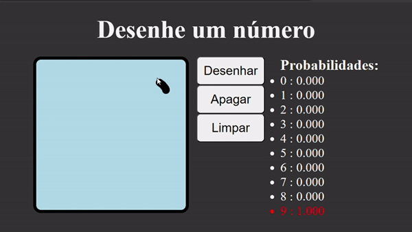

# Projeto de Reconhecimento de Dígitos Manuscritos



Este projeto é uma aplicação web simples que utiliza Flask e uma rede neural convolucional (CNN), treinada com o dataset MNIST, para reconhecer dígitos manuscritos. A aplicação permite que os usuários desenhem um dígito em uma tela de desenho e, em seguida, envia essa imagem para o servidor, onde é classificada pela CNN.

## Configuração do Ambiente

Para rodar este projeto, você precisará ter Python instalado em seu ambiente. Recomenda-se o uso de um ambiente virtual para a instalação das dependências.

```bash
# Criação do ambiente virtual (Linux/macOS)
python3 -m venv venv

# Criação do ambiente virtual (Windows)
python -m venv venv

# Ativação do ambiente virtual (Linux/macOS)
source venv/bin/activate

# Ativação do ambiente virtual (Windows)
.\venv\Scripts\activate

# Instalação das dependências
pip install -r requirements.txt
```

## Como Usar

1. Inicie o servidor Flask executando:

```bash
 flask --app server.py run
```

2. Abra um navegador e acesse 127.0.0.1:5000 ou o endereço que aparecer no terminal
3. Use a área de desenho para desenhar um dígito com o mouse ou com o dedo (em dispositivos touch).
4. Utilize os botões "Apagar" e "Limpar" conforme necessário para corrigir ou reiniciar seu desenho.

## Funcionalidades

- Desenho de Dígitos: Permite que os usuários desenhem dígitos manualmente para serem reconhecidos pela CNN.
- Classificação em Tempo Real: Após o envio do desenho, a imagem é classificada em tempo real e o resultado é exibido na tela.
- Limpeza de Tela: Fornece opções para apagar um desenho ou limpar completamente a tela de desenho.

## Tecnologias Utilizadas

- Flask: Framework web usado para construir o servidor.
- TensorFlow/Keras: Usados para construir e treinar a rede neural convolucional.
- HTML/CSS/JavaScript: Usados para construir a interface do usuário da aplicação web.

### Siga no LinkedIn

Conecte-se comigo no LinkedIn para acompanhar mais projetos como este e ficar por dentro das últimas atualizações e artigos que publico.

Siga-me no LinkedIn
<a href="https://www.linkedin.com/in/vinicius-fiedler/">
    
  </a>

### Leia o post no Medium

Para uma explicação mais detalhada sobre este projeto confira meu post no Medium.

Leia o post no Medium
<a href="https://img.shields.io/badge/Medium-12100E?style=for-the-badge&logo=medium&logoColor=white">
    
  </a>
